# Oversight

> A real-time dashboard for watching Claude Code agents work — conversations, tool calls, thinking blocks, task boards, team inboxes, and more, all live in your browser.

If you've ever spawned a long-running Claude Code session and wondered "what is it actually doing right now?", this is for you.

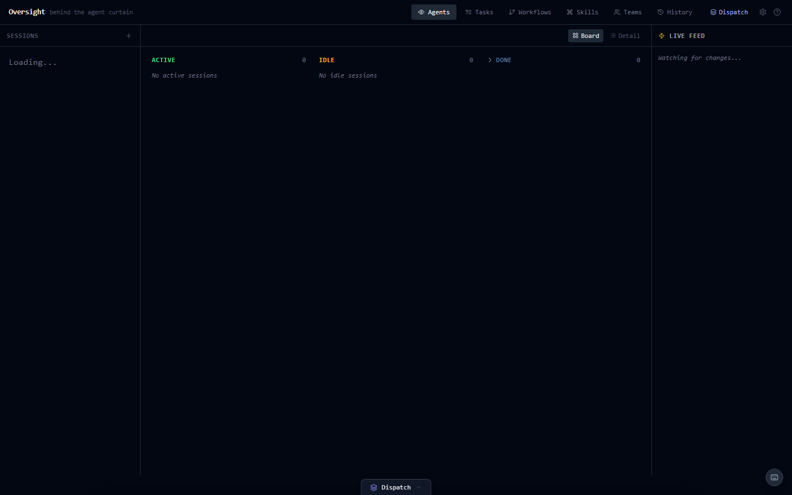

A three-pane layout: sessions sidebar on the left, board / detail in the middle, live SSE feed on the right, with the Dispatch launcher docked at the bottom. Everything updates in real time as `~/.claude/` changes on disk.

---

## Board View

The default view groups sessions into **Active**, **Idle**, and **Done** columns. Each card shows the session name, last message snippet, agent count, token usage, and model. Active sessions glow green; sessions waiting for human input pulse amber with quick-action buttons (yes, continue, approve) right on the card.

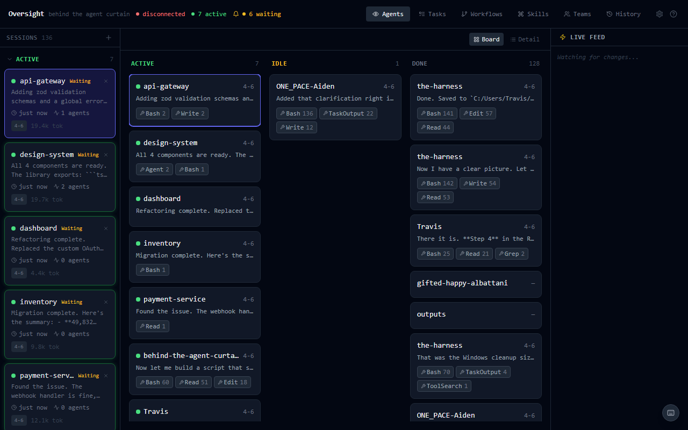

The sidebar lists all sessions grouped by **Active**, **Recent**, and **Older**. Click any session to open the detail view. The header shows live connection status and a count of sessions needing attention.

---

## Conversation View

Click into a session to see every message, thinking block, and tool call rendered as it happens. The agent's internal reasoning, tool inputs/outputs, and current position in the thread are all visible.

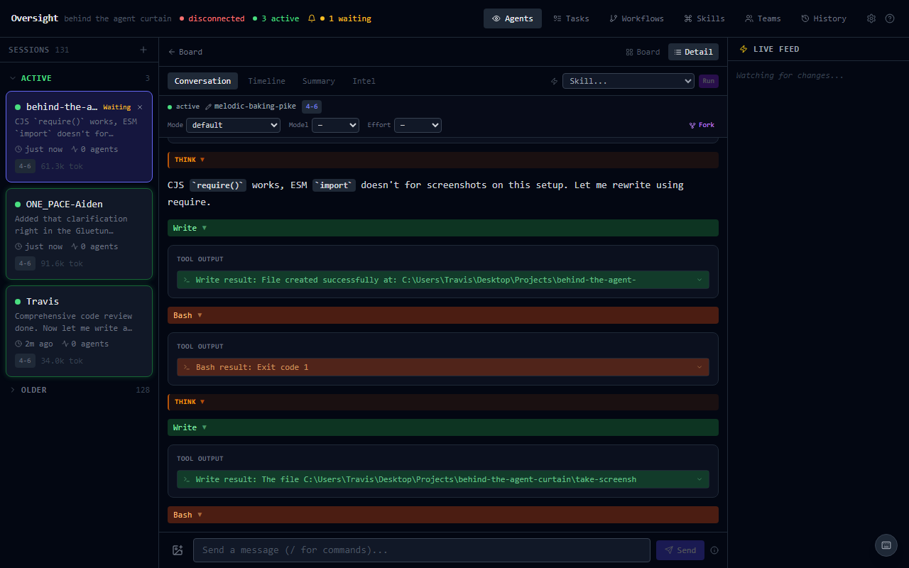

The message input at the bottom lets you send messages directly to the session. Attach images via the paperclip button, drag-and-drop, or Ctrl+V paste (PNG, JPEG, GIF, WebP, max 5MB). A thumbnail preview appears before sending.

A **skill picker** dropdown lets you invoke any user or plugin skill (e.g., `/commit`, `/review-pr`) on the current session.

The **session control bar** at the top shows:
- Session name (click the pencil icon to rename)
- Model badge and token count
- Permission mode, model, and effort dropdowns (applied to subsequent messages)
- Fork button to branch the conversation with a custom prompt

---

## Timeline

A flat, chronological event list with the time delta between each event. Useful for spotting where a session stalled, where it sped up, and exactly when a tool call fired.

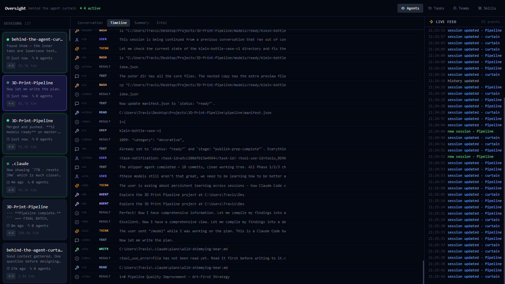

Each row shows the event type (THINK, TEXT, BASH, READ, etc.), a snippet of the content, and the gap since the previous event.

---

## Summary

High-level session metadata: session slug, git branch, last thought, last action, and a breakdown of every tool used with call counts.

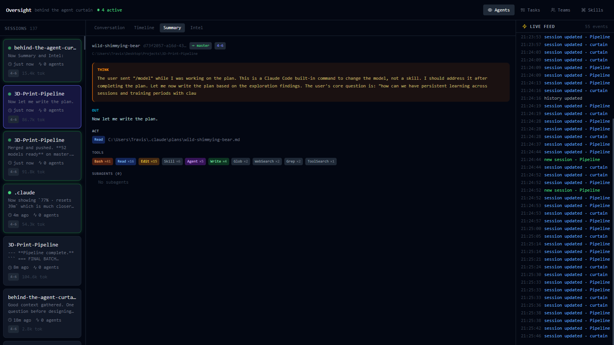

---

## Intel

Runs the session context through the `claude` CLI and returns a structured analysis: what the session is trying to accomplish, where it is in that goal, any flags worth attention, and a recommendation. Results are cached for 5 minutes and refresh automatically when the session changes significantly.

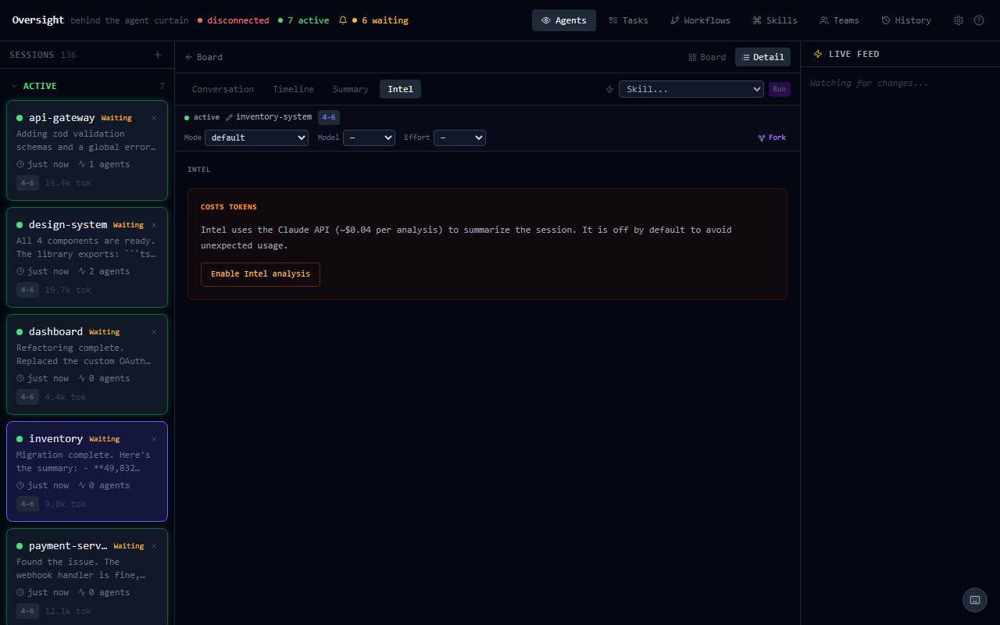

Requires `claude` in your PATH. Silently skips if not available.

---

## Tasks

Each session can have a task board. Create, edit, update status, assign owners, and manage dependencies (blocks/blockedBy). Tasks are stored as JSON files in `~/.claude/tasks/{sessionId}/`.

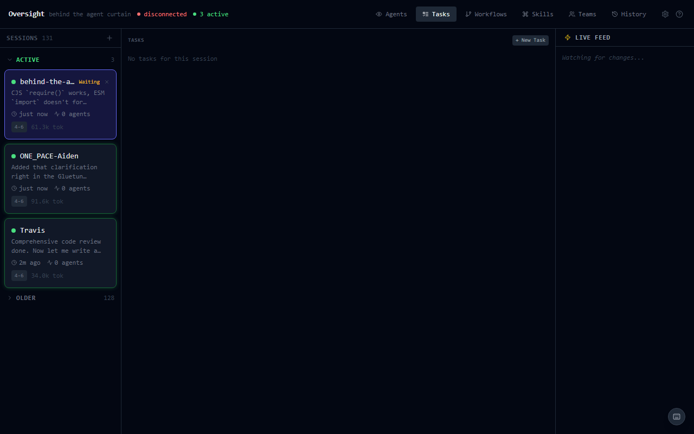

---

## Workflows

Build reusable multi-step playbooks. Each workflow is a named sequence of steps:

- **Instruction** — plain text for Claude to follow
- **Command** — a shell command to run
- **Agent** — spawn a subagent (general-purpose, Explore, Plan, etc.) with a custom prompt
- **Skill** — invoke any user or plugin skill

Create, reorder, edit, and delete steps with the visual editor. Click **Export as Skill** to turn a workflow into a reusable Claude Code skill file (saved to `~/.claude/skills/`).

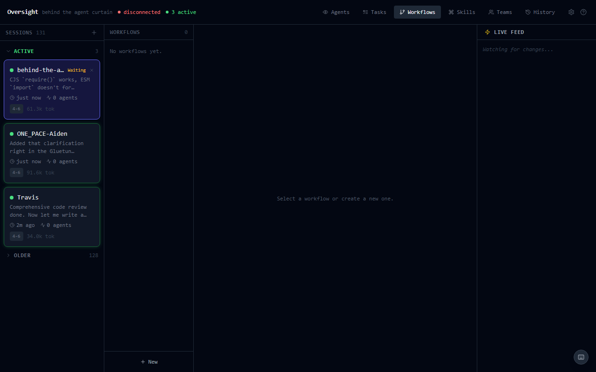

---

## Skills Browser

Browse, search, create, edit, and delete skills. Skills are grouped by source: user skills (editable) and plugin skills (read-only). Each skill shows its description, command, and full content (expandable). Filter by plugin name or search across all skills.

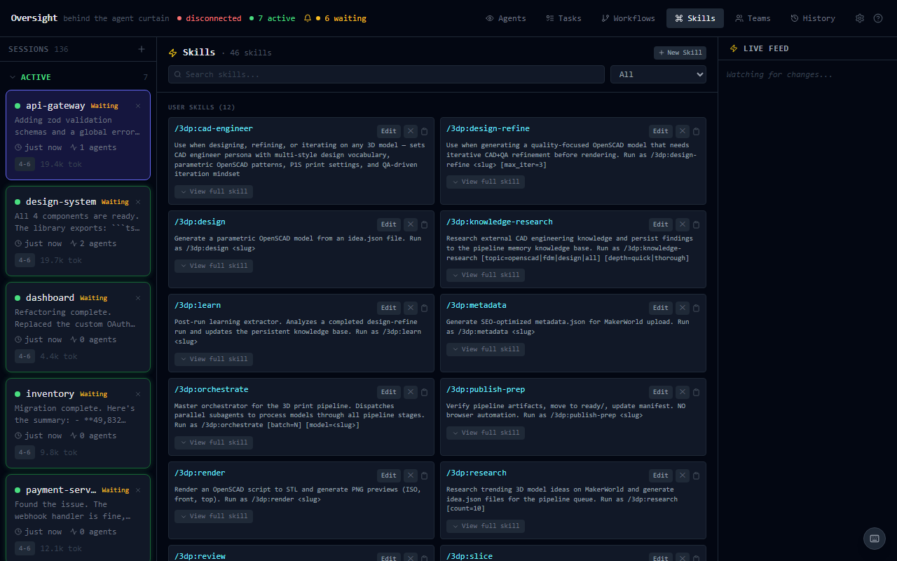

---

## Teams

See your Claude Code team task boards and inboxes. View what's in-flight, what's completed, and which agent is on what. Team inboxes support message threading with read/archived status.

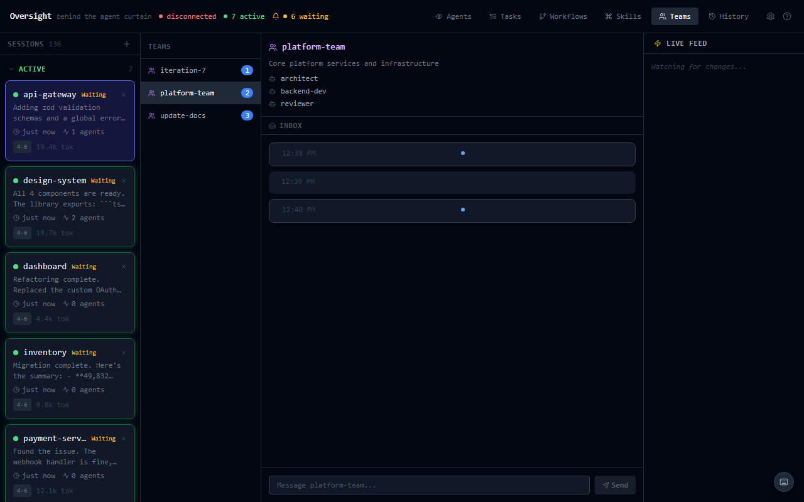

---

## History

Browse your Claude Code command history with search, project filtering, and grouped/list view toggle. Stats show total commands, projects, and timespan at a glance.

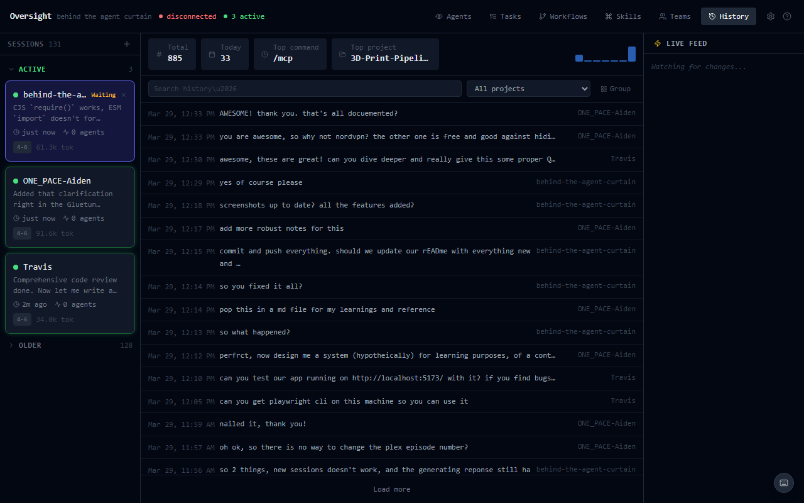

---

## New Sessions

Click the **+** button at the top of the sidebar to open the inline new-session form. Everything you need lives in the sidebar itself — no modal, no context switch.

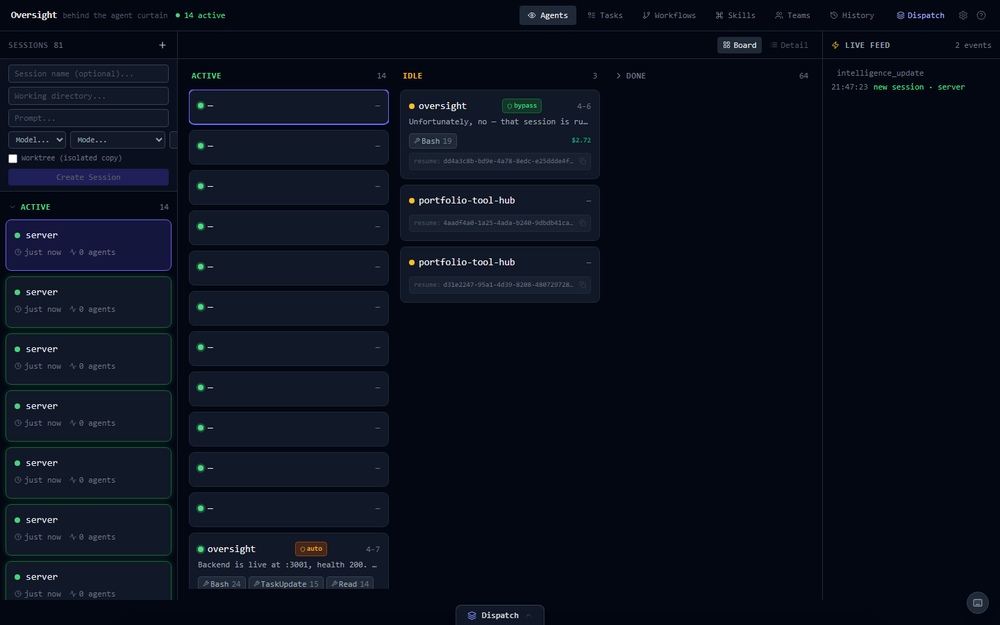

Fill in a working directory and prompt (required), plus optional session name, model (`sonnet` / `opus` / `haiku`), permission mode, and worktree isolation. The **folder icon** next to the working-directory input opens a lightweight folder picker.

### Folder Picker

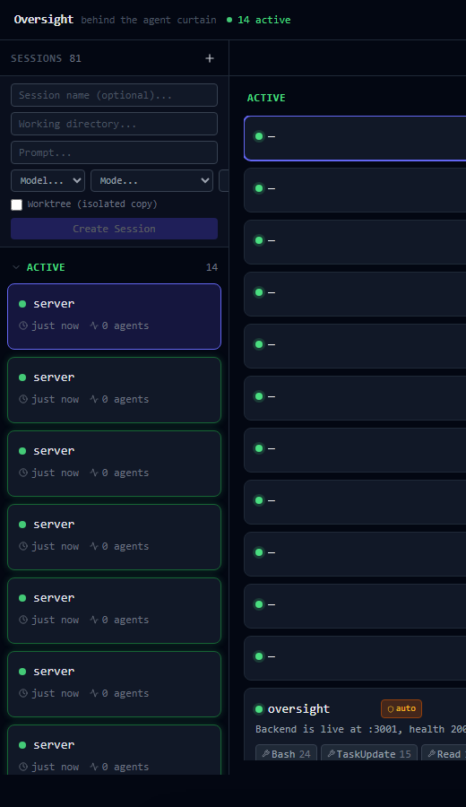

- Breadcrumb path with **Home** and **Up** buttons
- **Recent** chips populated from the working directories of existing sessions
- **Show hidden** toggle for dotfiles
- Platform-aware: backed by `/api/fs/home` and `/api/fs/list`, which return the host's path separator so the picker works on macOS, Linux, and Windows
- Rejects UNC / remote-share paths on Windows by design — Oversight is a local dashboard and shouldn't enumerate network shares

### How a session is spawned

New sessions are created via a one-shot CLI subprocess (`claude -p … --output-format json`). Interactive messaging after creation runs through a PTY on your Claude subscription — **no API credits consumed**.

**Early ack — you're inside the session in ~500 ms.** The server no longer waits for the CLI to finish before responding. It races the full CLI run against the file watcher noticing the new JSONL file on disk. The moment the watcher fires, the route returns `202 { pendingSessionId }` and the dashboard drops you straight into the conversation view. The CLI keeps running in the background, streaming updates through the existing SSE channel — you're watching Claude think in real time instead of staring at a "Creating…" spinner for the whole 10-60 s run.

If the CLI exits non-zero before the watcher fires (e.g. a 429 quota response), the error panel renders the captured `stderr` and `stdout` in scrollable monospace blocks so you see the real cause instead of an opaque "exited with code=1".

If the CLI *does* exit non-zero **after** the ack (the JSONL is already on disk, the client is already inside the session), the failure is logged at warn-level and the already-partial transcript stays visible. The 15-second ack deadline returns `504 timeout_waiting_for_session` if nothing appears.

> The `effort` option is SDK-only and is not valid for the one-shot `-p` CLI used here. It's exposed on the per-message **Session Control Bar** inside each conversation (SDK path), where it actually takes effect.

---

## Dispatch Manager

A single "one message, many sessions" launcher. Click the **Dispatch** button at the bottom of the screen (or press `d`) to open the manager:

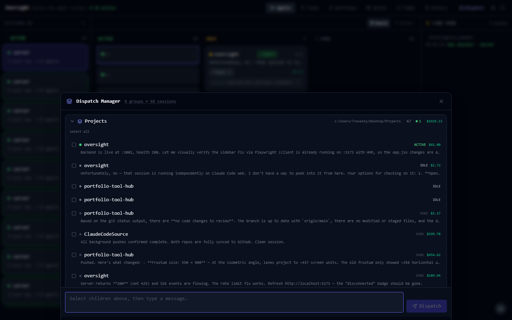

- Sessions are grouped by project (and any configured teams) so you can fan out to everything relevant in one click
- Per-row status, cost, and last-message preview mean you can pick the right targets without leaving the launcher
- Guards against sending an empty message, no-selected-sessions, or a session that already has an in-flight query (HTTP 409)
- The message is routed through the same PTY path as the conversation view, so each recipient's JSONL is updated live and every dashboard tab sees it

Typical uses: broadcasting a status-check ping, telling every active agent to commit, or running the same `/review-pr` skill across a fleet of worktrees.

---

## Settings

Open with the gear icon or `,` key. Three tabs: Notifications, Sounds & Voice, and Shortcuts.

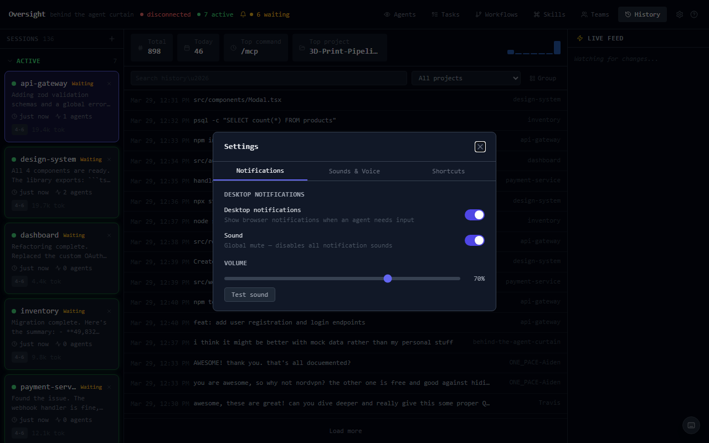

### Notifications & Sound

Oversight detects when a session is waiting for human input — either Claude finished speaking (`end_turn`) or a tool call is pending approval. When this happens:

- **Amber pulse** on the session card in both sidebar and board
- **Header badge** shows count of sessions waiting
- **Desktop notifications** via the browser Notification API
- **Event-specific sounds** via the Web Audio API

Sessions older than 4 hours are considered abandoned and won't trigger notifications.

**8 built-in synthesized sounds** (no external files):

| Preset | Description |
|--------|-------------|
| `chime` | Two ascending tones — default for "needs input" |
| `ping` | Single 800Hz tone, 200ms fade |
| `alert` | Three rapid square-wave pulses |
| `gentle` | Soft 440Hz sine, slow fade |
| `urgent` | Alternating sawtooth tones, 3 cycles |
| `success` | Major triad arpeggio |
| `fail` | Minor second descend |
| `none` | No sound |

**Text-to-speech:** Enable per-event TTS voice announcements. Choose from any system voice. New announcements cancel in-progress speech automatically.

**Custom sounds:** Upload `.mp3` or `.wav` files (up to 500KB each, 2MB total) and assign them to any event type.

### Keyboard Shortcuts

All shortcuts are rebindable in Settings. Support for modifier combos (`Ctrl+k`, `Shift+j`, etc.).

| Key | Action |
|-----|--------|
| `j` / `k` | Navigate sessions (next / previous) |
| `Enter` | Open detail view for selected session |
| `Escape` | Back to board view / close modals |
| `1` - `6` | Switch tabs (Agents, Tasks, Workflows, Skills, Teams, History) |
| `y` | Approve — send "yes" to waiting session |
| `c` | Continue — send "continue" to waiting session |
| `/` | Focus message input |
| `m` | Mute selected session's notifications |
| `d` | Open Dispatch Manager |
| `,` | Open settings |
| `?` | Toggle shortcut overlay |

---

## Interactive Session Control (PTY)

When you send a message from the Conversation view, Oversight spawns a pseudo-terminal running `claude --resume <sessionId>` rather than making API calls. **Dashboard messaging uses your existing Claude subscription** — no API credits consumed.

**Tool approval workflow:**
1. Claude requests to use a tool (e.g., Bash, Write)
2. Oversight detects the approval prompt in the PTY output
3. An amber **Tool Approval Banner** appears in the conversation view
4. Click **Allow** or **Deny** — the response is typed into the PTY
5. Auto-denied after 120 seconds if no action taken

The PTY stays alive between messages for the same session. Concurrent writes to the same session are blocked (409 Conflict).

**Completion detection** uses dual mechanisms: PTY output silence (3s of no TUI redraws) and JSONL file silence (8s fallback), with a 10-minute safety timeout.

---

## Live Feed

The right sidebar shows a real-time stream of all SSE events: session updates, new sessions, task changes, team updates, and intelligence results. Useful for seeing cross-session activity at a glance.

---

## How It Works

```
                    ┌─────────────┐
~/.claude/ ──────►  │  chokidar   │──► SSE ──► React
                    │  (watcher)  │
                    └─────────────┘
                          │
┌─────────────────────────┼──────────────────────────┐
│                         │                          │
▼                         ▼                          ▼
PTY sessions          CLI subprocess           claude CLI
(pty-session.js)      (claude-cli.js)         (Intel tab)
- send messages       - new sessions
- tool approval       - fork sessions
- subscription auth   - worktree sessions
```

The server watches `~/.claude/` with chokidar. When files change, it parses the relevant JSONL or JSON, then pushes Server-Sent Events to all connected browser tabs.

For **interactive messaging**, Oversight spawns `claude --resume <sessionId>` in a PTY so it runs on your Claude subscription. For **one-shot operations** (new sessions, fork, worktree), it uses the CLI subprocess. Either way, the CLI writes to the session's JSONL file, chokidar picks up the change, and SSE pushes the update.

### Data Sources

| Path | What's there |
|------|-------------|
| `~/.claude/projects/*/*.jsonl` | Session threads (messages, tool calls, thinking) |
| `~/.claude/tasks/{sessionId}/*.json` | Task boards linked to sessions |
| `~/.claude/teams/*/config.json` | Team configs and task queues |
| `~/.claude/teams/*/inboxes/*.json` | Team inbox messages |
| `~/.claude/history.jsonl` | Command history |
| `~/.claude/skills/*.md` | User skill files |
| `server/data/workflows/*.json` | Workflow definitions |
| `server/data/session-names.json` | Custom session display names |

### SSE Event Types

`session_update`, `new_session`, `task_update`, `team_update`, `history_update`, `intelligence_update`, `sdk_message`, `sdk_result`, `sdk_error`, `tool_approval_request`, `tool_approval_resolved`

---

## Setup

**Prerequisites:** Node 22+, Claude Code CLI in PATH.

```bash
git clone https://github.com/CosmonautJones/oversight.git
cd oversight
npm install
cd client && npm install && cd ..
cd server && npm install && cd ..
```

```bash
npm run dev
```

Opens on http://localhost:5173. The API server runs on :3001.

### Testing

```bash
npm test              # Run all server + client tests
npm run test:server   # Server tests only (Vitest)
npm run test:client   # Client tests only (Vitest + React Testing Library)
npm run test:e2e      # End-to-end tests (Playwright)
```

---

## Quirks

- **Garbled project names in the sidebar** — cosmetic only. The path encoding turns `/` into `-` in the directory name, and the decoder gets it wrong in edge cases. The `cwd` field inside each session record is always correct.
- **Intel tab requires `claude` in PATH** — if it's not available, the tab just won't populate.
- **Intel analysis on very large sessions can time out** — the 30-second timeout on the `claude` CLI call will fire on sessions with thousands of messages. The tab shows the last cached result instead.
